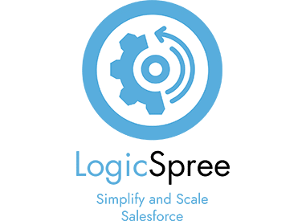
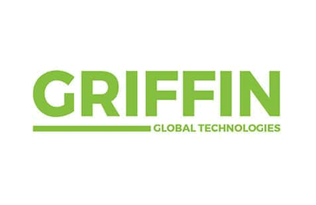
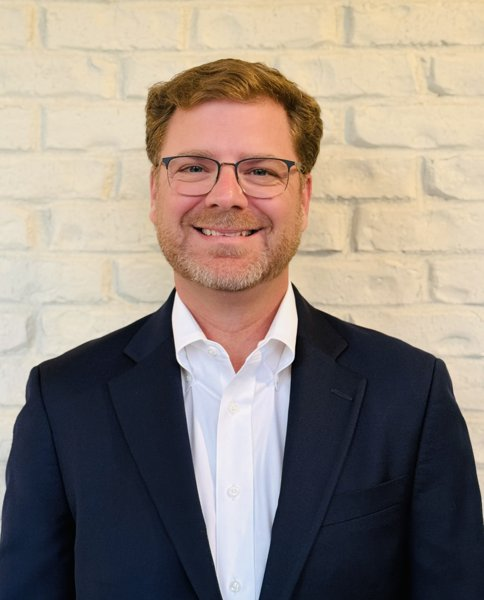
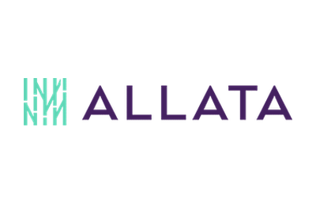
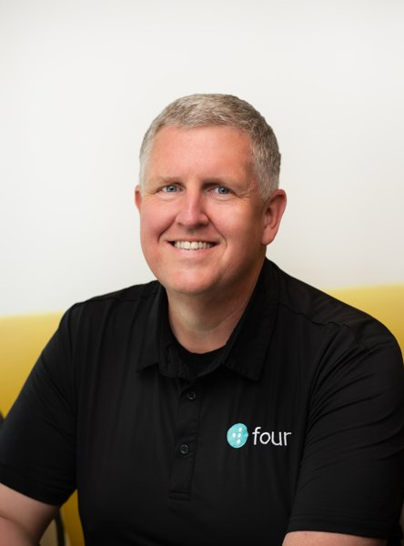

# Your AI Program Has a Bad Feeling About This

Public archive for the ATP event "Your AI Program Has a Bad Feeling About This." It's an interactive workshop on why enterprise AI initiatives fail, run as the honest, hands-on debrief nobody runs at their own company.

- **Date:** September 17, 2026, 6:00 to 8:30 PM
- **Location:** Social House Roswell, 1098 Green St, Roswell, GA 30075
- **Details / registration:** https://atpconnect.org/events/your-ai-program-has-a-bad-feeling-about-this/
- **Fleet Command:** John Trainor (President, Four Technologies, ATP Executive Advisory Board)

Scan the QR code above to come back to this repo after the event. It's also displayed at the event itself, where you'll find the station transcripts and the closeout session talking points.

## The ATP team

The Event Council: the three ATP leads who own the event, from the first planning call to the last transcript posted here.

<table><tr>
<td width="96" valign="top"></td>
<td valign="top"><b>Scott Harris</b>, One Inc ATP Finance Chair, <a href="https://atpconnect.org/about/board-of-directors/">Board of Directors</a> &middot; <a href="https://www.linkedin.com/in/scottmichaelharris">LinkedIn</a>  Owns the run of show. On the night he is also the timekeeper who calls time on all five stations, which is the one thing the entire closeout synthesis window depends on.</td>
</tr><tr>
<td width="96" valign="top"></td>
<td valign="top"><b>Tom Lasswell</b>, DC BLOX ATP Director of Technology, <a href="https://atpconnect.org/about/board-of-directors/">Board of Directors</a> &middot; <a href="https://www.linkedin.com/in/lasswellt/">LinkedIn</a>  Owns logistics. Drafted the question list for every station, and is day-of tech support: first responder on any laptop, network, or Teams problem, and the backstop to the Flight Engineers.</td>
</tr><tr>
<td width="96" valign="top"></td>
<td valign="top"><b>John Slaughter</b>, Alliant Health Chief Information Officer, ATP <a href="https://atpconnect.org/about/executive-advisory-board/">Executive Advisory Board</a> &middot; <a href="https://www.linkedin.com/in/john-slaughter-4b578/">LinkedIn</a>  Recruited the station pilots: the five CIOs, CTOs, and founders who each agreed to run a room for an evening and say true things out loud.</td>
</tr></table>

## Format

Attendees split into five themed stations of about 25 people, each covering a distinct way enterprise AI programs go wrong. Each station is a guided discussion, not a talk: the station pilot puts a list of roughly eight questions to the room and the room answers. Fleet Command hosts, records, and transcribes each one via an independent Teams meeting, and every station has a Flight Engineer whose only job is to watch that the capture is actually working. No one in any single station gets the full picture. That's the point of what comes next.

Immediately afterward, the group reassembles for **the Throne Room**, the closeout session. Everyone who spent the evening in a different room, back together at the end. It's the one vantage point that actually sees the patterns across all five stations at once, distilled into shared talking points. See [`closeout/`](closeout/).

This repo documents the full method, not just the output. That includes [how the Throne Room deck was actually synthesized](tools/synthesize-closeout/) from the five station transcripts in the few minutes between sessions ending and the group reassembling, and [the rehearsal harness](tests/) we used to run the whole night end to end beforehand, including every way it could fail.

## The five stations

Pick the one that sounds most like your own program. Full pilot bios, the question list each pilot will work from, and, after the event, the transcript, are in each station's folder.

### Sky City

**Infrastructure and integration challenges with third-party tools.** Every vendor deal was made in good faith. Right up until the terms changed underneath someone. This station is about the moment those terms changed, and what it cost to find out mid-flight rather than in the contract review.

<table><tr>
<td width="96" valign="top"></td>
<td valign="top"><b>Station pilot:</b> Dorren Schmitt, PhD VP of IT Strategy and Innovation, The Weather Channel and Allen Media Group  <a href="stations/sky-city/questions.md">Question list</a> &middot; <a href="stations/sky-city/">Station folder</a></td>
</tr></table>

### Swamp Planet

**Technical debt and data quality issues.** The ship sank because nobody had dealt with what was underneath it. This station is about the swamp under every AI project: the data nobody cleaned up, the schema nobody updated, the owner who left, and the pilot that became production without anyone rebuilding it.

<table><tr>
<td valign="top"><b>Station pilot:</b> To be announced  <a href="stations/swamp-planet/questions.md">Question list</a> &middot; <a href="stations/swamp-planet/">Station folder</a></td>
<td width="200" align="center" valign="middle"><a href="https://www.logicspree.com/"><picture><source media="(prefers-color-scheme: dark)" srcset="assets/sponsors/logicspree-dark.png"></picture></a> Station sponsor</td>
</tr></table>

### Ice Planet

**Use cases, costs, and scope creep.** Everyone's dug in, waiting on a decision that hasn't come. This station is about the AI use cases stuck in exactly that position: not cancelled, not shipped, while the cost meter keeps running and the original ask quietly grows into something nobody approved.

<table><tr>
<td width="96" valign="top"></td>
<td valign="top"><b>Station pilot:</b> Mat Mathews Chief Information Officer, Fortrex  <a href="stations/ice-planet/questions.md">Question list</a> &middot; <a href="stations/ice-planet/">Station folder</a></td>
<td width="200" align="center" valign="middle"><a href="https://griffinglobaltech.com/"><picture><source media="(prefers-color-scheme: dark)" srcset="assets/sponsors/griffin-dark.png"></picture></a> Station sponsor</td>
</tr></table>

### Snow Monster Cave

**Development.** Nobody wants to be the one left hanging when something breaks. This station is about what's actually happening inside the build: the testing, the on-call, the ownership decisions nobody wrote down, and the engineer who ends up holding all of it.

<table><tr>
<td width="96" valign="top"></td>
<td valign="top"><b>Station pilot:</b> Mike Park Chief Information Officer, Infor  <a href="stations/snow-monster-cave/questions.md">Question list</a> &middot; <a href="stations/snow-monster-cave/">Station folder</a></td>
<td width="200" align="center" valign="middle"><a href="https://www.allata.com/"><picture><source media="(prefers-color-scheme: dark)" srcset="assets/sponsors/allata-dark.png"></picture></a> Station sponsor</td>
</tr></table>

### Asteroid Field

**Compliance, legal, and security.** Everyone said to stay out of it. Then you flew straight through anyway, because turning back wasn't an option. This station is about the compliance, legal, and security review everyone dreaded and went through anyway: what it caught, what it cost to go around it, and what employees were doing with AI tools the whole time nobody was looking.

<table><tr>
<td width="96" valign="top"></td>
<td valign="top"><b>Station pilot:</b> Dante Jackson Founder and CEO, Serket-Tech Security  <a href="stations/asteroid-field/questions.md">Question list</a> &middot; <a href="stations/asteroid-field/">Station folder</a></td>
</tr></table>

## Fleet Command

**John Trainor**, President of Four Technologies, a rapidly growing AI-first FinTech company. His previous roles include CTO of Wahoo Fitness and CIO of Aaron's, and he holds an Electrical Engineering degree from Georgia Tech. John has been an active member of ATP for over 15 years and has led a number of technology industry organizations in Atlanta. An avid endurance athlete, he runs marathons with his wife Heather, but his favorite thing to do is spend time with his two grandchildren.

On the night he hosts, records, and transcribes all five stations, runs the closing synthesis, and presents the Throne Room.

 

## Station sponsors

<table align="center"><tr>
<td align="center" width="240"><a href="https://www.logicspree.com/"><picture><source media="(prefers-color-scheme: dark)" srcset="assets/sponsors/logicspree-dark.png"></picture></a> Swamp Planet</td>
<td align="center" width="240"><a href="https://griffinglobaltech.com/"><picture><source media="(prefers-color-scheme: dark)" srcset="assets/sponsors/griffin-dark.png"></picture></a> Ice Planet</td>
<td align="center" width="240"><a href="https://www.allata.com/"><picture><source media="(prefers-color-scheme: dark)" srcset="assets/sponsors/allata-dark.png"></picture></a> Snow Monster Cave</td>
</tr></table>

## Take this and run it yourself

**[RUN-THIS-YOURSELF.md](RUN-THIS-YOURSELF.md)** is the transferable part: ten principles that made the closeout session reliable enough to present unreviewed in front of a hundred people, each with the code that implements it and the defect it caught, followed by how to run the event format at your own organization.

The short version, since the event is about why enterprise AI programs fail and it would be embarrassing to run it on one that does: be deterministic wherever determinism is available, never ask a model a question you can already answer, constrain the output until a machine can validate it, write the evals before the night and test the disasters, score the things you would otherwise argue about, and measure instead of estimating.

## Contents

- [`RUN-THIS-YOURSELF.md`](RUN-THIS-YOURSELF.md): the principles behind the method, and how to run it at your own organization
- [`crew-manifest.md`](crew-manifest.md): who held which role on the day, and what was still unfilled going in
- [`station-pilot-instructions.md`](station-pilot-instructions.md): what station pilots needed to prepare and run their session
- [`coordinator-checklist.md`](coordinator-checklist.md): Fleet Command's runbook for hosting, recording, and monitoring all five stations, and running the closing synthesis
- `stations/`: question list per station before the event, transcript and notes after it
- [`closeout/`](closeout/): the Throne Room, the synthesized closeout session deck, added after the event. [Read it here.](https://atpconnect.github.io/atp-ai-bad-feeling/closeout/presentation.html)
- [`tools/synthesize-closeout/`](tools/synthesize-closeout/): the tool and guiding framework used to turn the five transcripts into the closeout deck
- [`tools/intake-transcript/`](tools/intake-transcript/): files transcripts off the laptop and out of email as they arrive
- [`tools/build-deck/`](tools/build-deck/): validates the model's output and renders the deck, deterministically
- [`tests/`](tests/): the rehearsal harness we ran the night on before the night, and the four real defects it caught

## Contributing

Pull requests are welcome. Corrections to a transcript, additional context on a station's topic, or your own notes if you were in the room are all fair game. This is meant to be a living record of the event, not a frozen archive.
