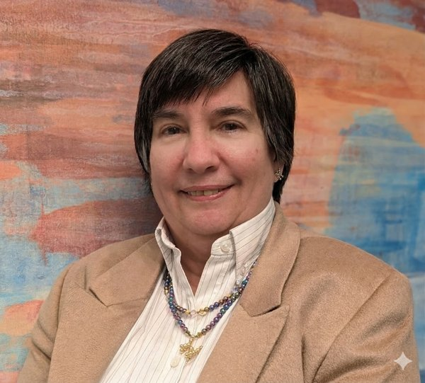

# Sky City

**Theme:** Infrastructure and integration challenges with third-party tools
**Station pilot:** Dorren Schmitt, PhD, VP of IT Strategy and Innovation, The Weather Channel and Allen Media Group

Every vendor deal was made in good faith. Right up until the terms changed underneath someone.

## Station pilot

**Dorren Schmitt, PhD**, VP of IT Strategy and Innovation, The Weather Channel and Allen Media Group.

Dorren has spent more than two decades spearheading engineering initiatives, including artificial intelligence, high-performance computing, virtualization, enterprise applications, enterprise infrastructure modernization, data and cloud migration, M&A integration, cybersecurity, and digital transformation. She architected and now leads the teams responsible for infrastructure across hybrid cloud environments, as well as the enterprise-wide AI and IT strategy, and is currently driving the modernization of legacy systems through AI and cloud solutions and defining the future of the company's digital transformation.

She holds a PhD in Applied Statistics. Her work has been recognized with Woman of the Year for Women in Technology (2019) and Top 50 Women Leaders in Atlanta (2025, 2026). She is the author of "The AI Production Playbook: Turning AI Experiments into Enterprise-Scale Business Systems".

 

Before the event: this station's question list, with pre-filled likely answers, goes in `questions.md`. It doubles as the fallback if no transcript is captured.
After the event: the exported transcript goes in `transcript.md` (or `.txt`/`.docx`), used by [`tools/synthesize-closeout/`](../../tools/synthesize-closeout/) to build the closeout draft.
